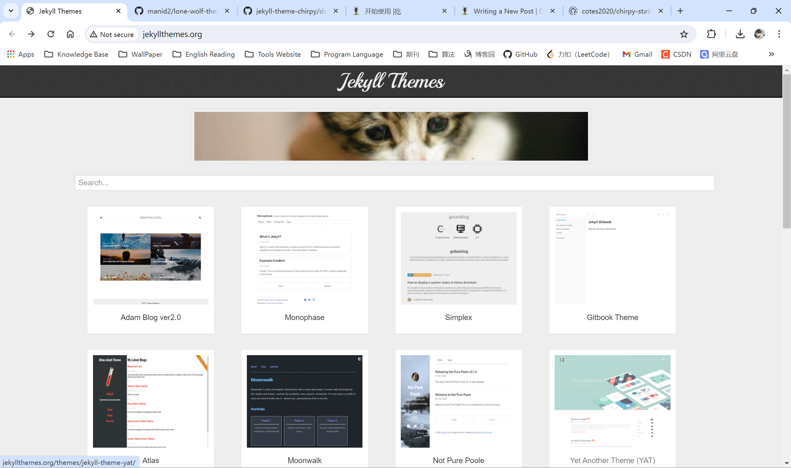
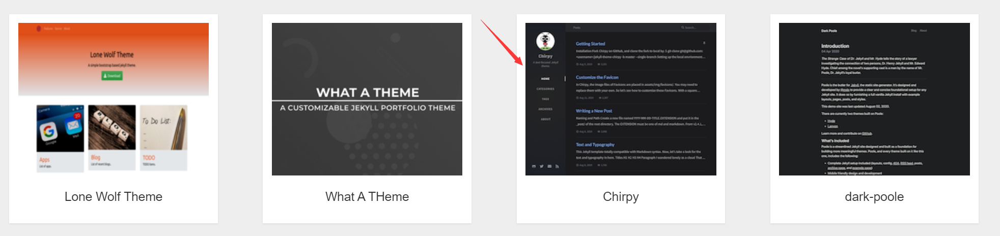
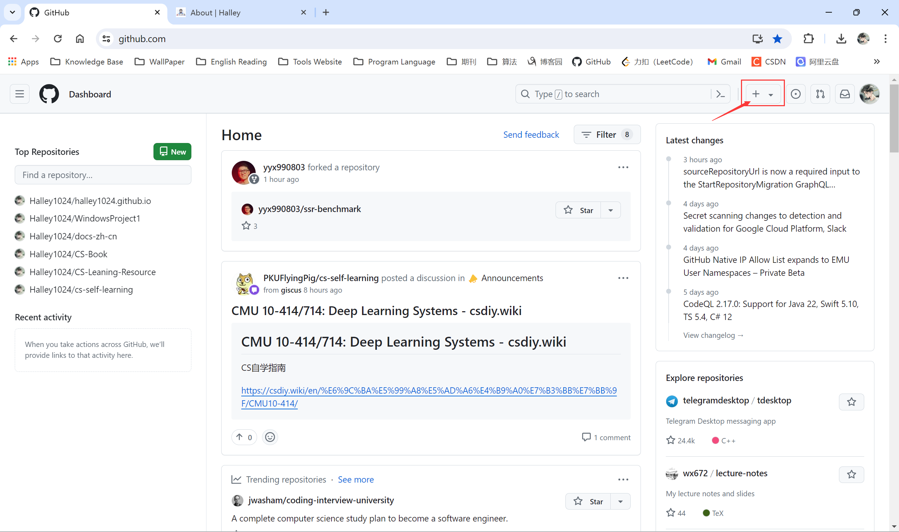
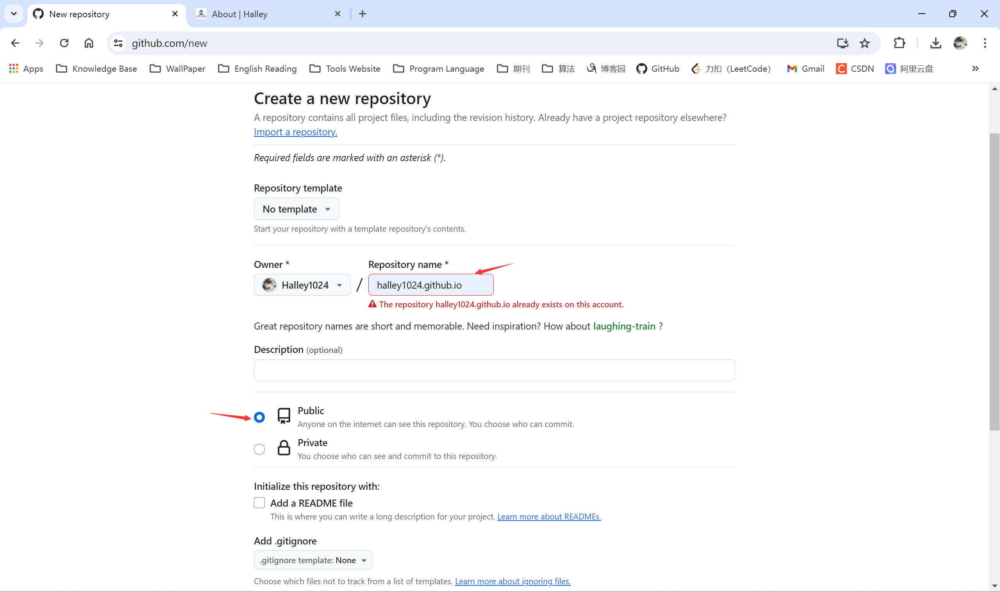
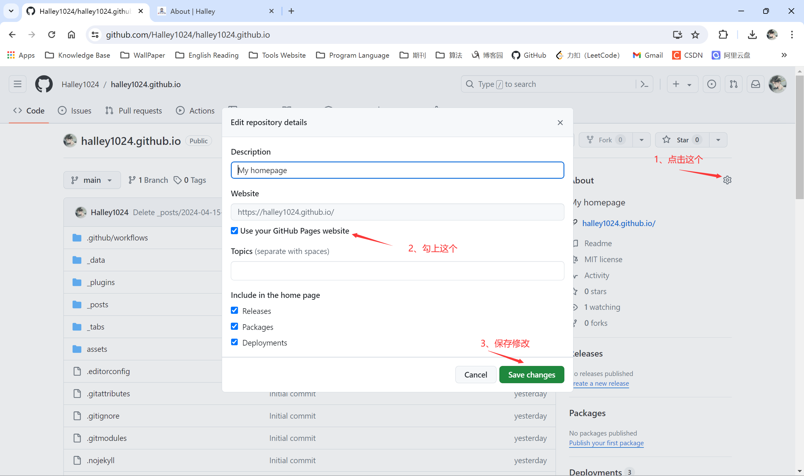
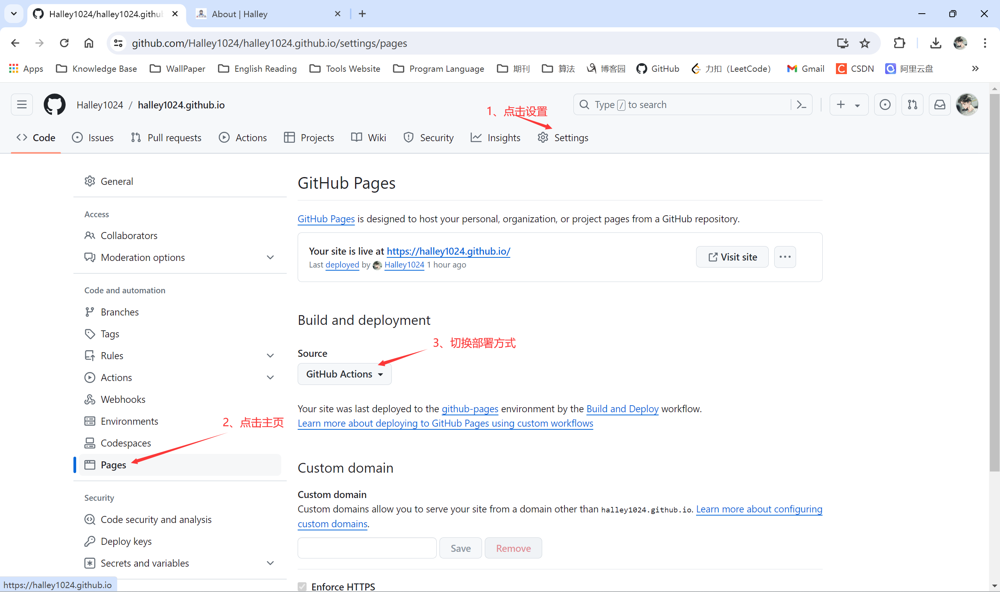
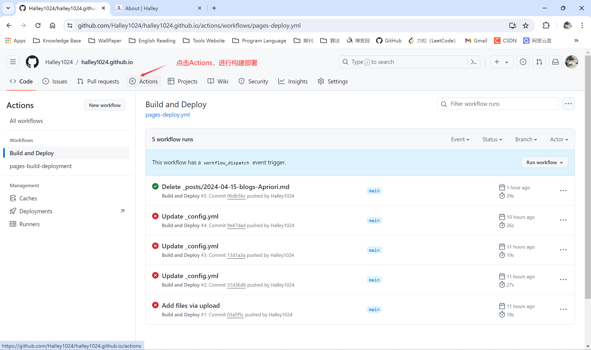
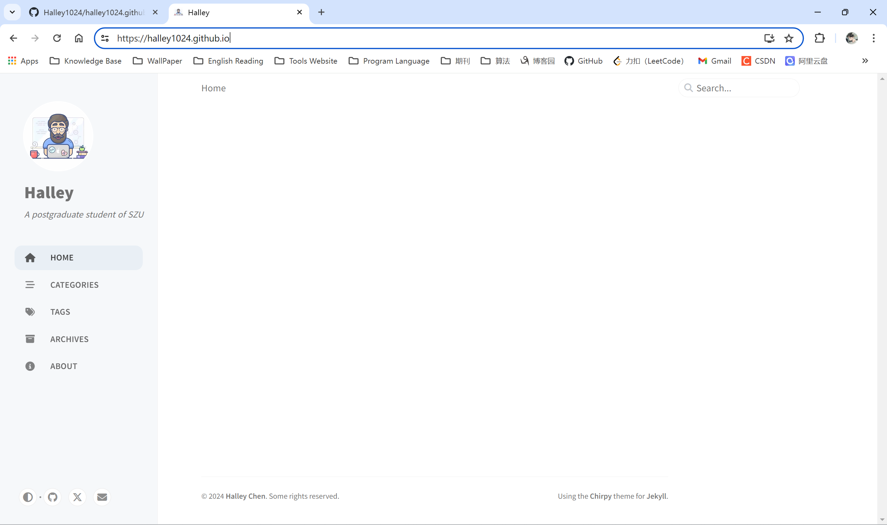

# Github制作个人主页方法

## 一、选择主页主题（自制可略）

1. 在jekyll theme网址:(http://jekyllthemes.org/) 中寻找自己想要的主题

   

2. 点击任意一款进入（示例）

   

   

3. 点击Download

   下载完成后解压打开即可

## 二、需要的依赖

1. git命令需要下载，直接去官网下载https://git-scm.com/
2. jekyll下载
   1. 需要的配置环境
      1. [Ruby](https://www.ruby-lang.org/en/downloads/) version **2.5.0** or higher, including all development headers (check your Ruby version using `ruby -v`)
      2. [RubyGems](https://rubygems.org/pages/download) (check your Gems version using `gem -v`)
      3. [GCC](https://gcc.gnu.org/install/) and [Make](https://www.gnu.org/software/make/) (check versions using `gcc -v`,`g++ -v`, and `make -v`)
   2. 通过Ruby安装
      - 安装Ruby+Devkit，网址：https://rubyinstaller.org/downloads/
      - 安装过程中，如果不会配置系统环境的话，那么就选择将Ruby添加到bin path中
      - 安装好后会出现一个黑窗，有三个选项，直接选第三个``MSYS2 and MINGW development tool chain``
      - 打开`cmd`，输入` gem install jekyll bundler`安装jekyll
      - 在`cmd`中输入`jekyll -v`，检查jekyll是否安装成功，若出现版本信息则说明安装成功

## 三、本地启动服务器

1. 直接进入下载好的主题文件，在当前目录文件下打开终端，输入`bundle`命令，等待下载jekyll依赖
2. 下载完成，输入`bundle exec jekyll s`，启动服务器，浏览器URL输入`http://127.0.0.1:4000/项目名/`（终端信息中有server address）
3. 启动成功后，自己修改相关的配置信息

## 四、部署到github上

1. 创建新的仓库

   

2. 输入新仓库名称`GitHub的账户名.github.io`

   

3. 创建好后，直接上传文件夹（这里我已经创建了，因此不演示了）
4. 将该仓库作为自己的主页

   

5. 设置

   

6. 构建部署

   

7. 效果

   

个人主页:[https://halley1024.github.io](https://halley1024.github.io)

